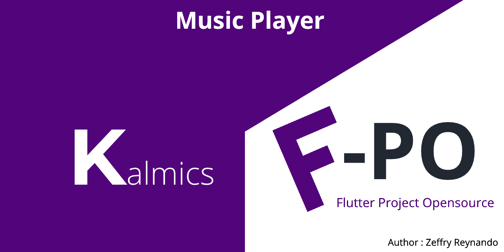
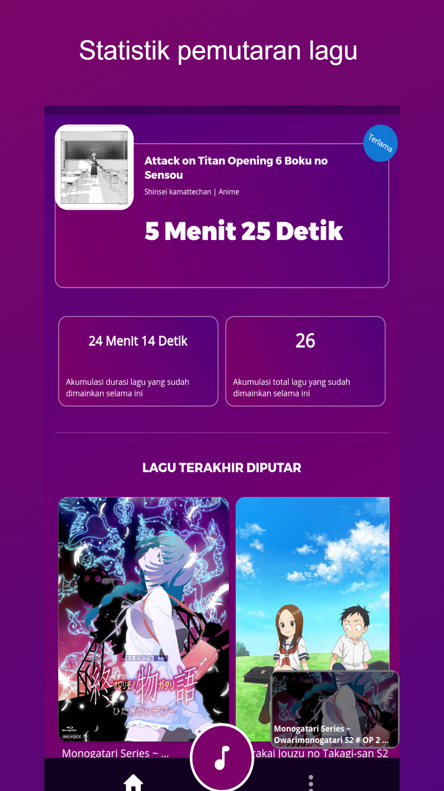
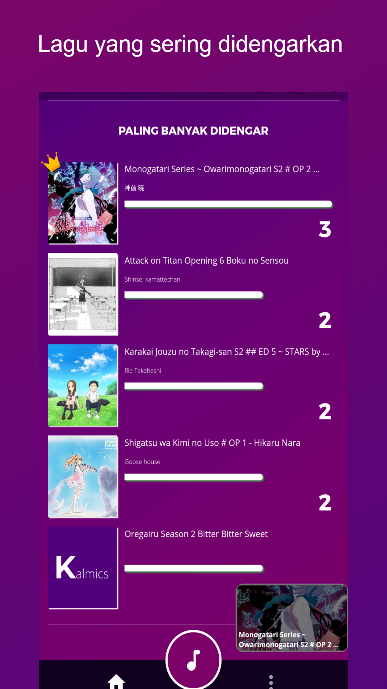
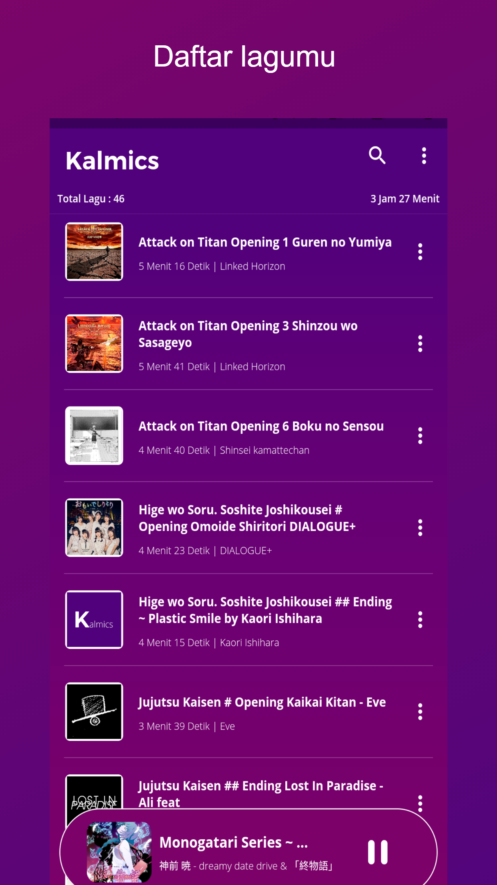
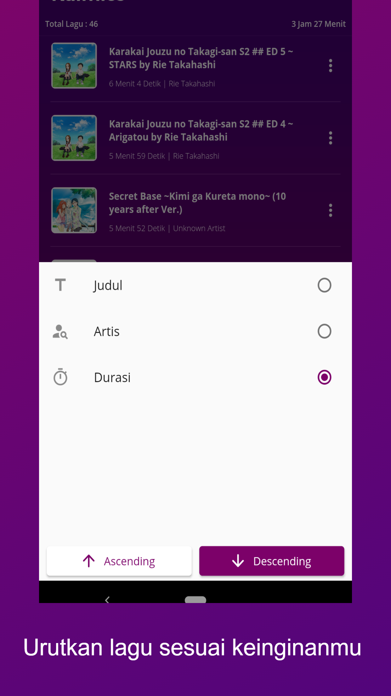
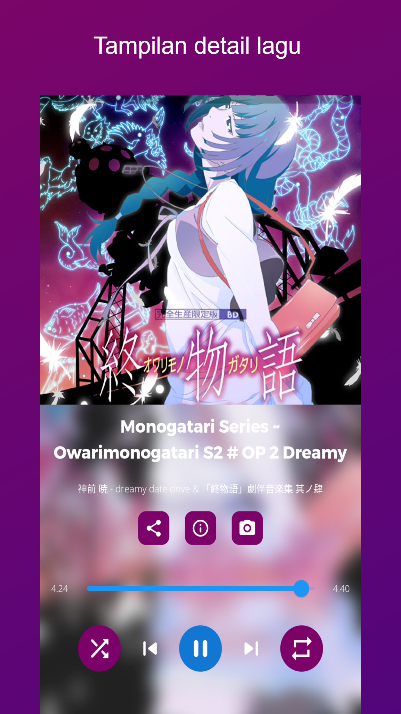
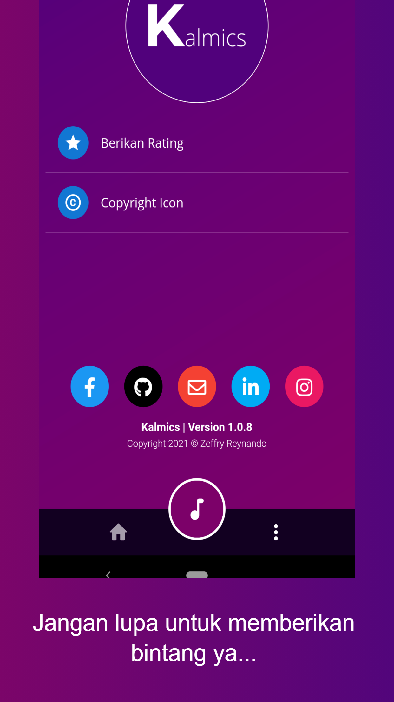

  

# Get it on : 

# Kalmics

Simple application to play music on your storage

## Feature 

### Completed
- [x] Onboarding screen
- [x] Sync song from storage
- [x] Song playback statistics every month
- [x] 5 Top chart
- [x] List of recently listened songs
- [x] Search, SortBy song
- [x] Timer for stop song (usefull for bedtime)
- [x] Detect song is ADD,MODIFY,DELETE from your storage
- [x] Floating music player
- [x] Edit tag song file
- [x] Shuffle, Loop (All,Single,None), Prev, Next song
- [x] Share song file
- [x] Info how many songs have been played
- [x] share the song you are listening to on social media
- [x] Re-design dashboard
- [x] Show total duration listening all song
- [x] Show total duration listening each song

 
### Uncompleted
- [ ] Multiple playlist
- [ ] Add song to favorite
- [ ] Set song as ringtone
- [ ] Cut song

## Preview Application

<table>
  <tr align="center">
    <!-- <td>Onboarding Screen</td>
    <td>Most played song</td>
    <td>List recently played song</td> -->
  </tr>
  <tr>
    <td></td>
    <td></td>
    <td></td>
  </tr>
   <tr align="center">
    <!-- <td>List of musics</td>
    <td>Detail Music</td>
    <td>Share to Instagram</td> -->
  </tr>
  <tr>
    <td></td>
    <td></td>
    <td></td>
  </tr>
  <tr align="center">
    <!-- <td>Info Application</td>
    <td>Sort By Feature</td> -->
  </tr>
  <tr>
    <td></td>
    <td></td>
  </tr>
 </table>

 ## Issues

Please file any issues, bugs or feature request as an issue on <a href="https://github.com/zgramming/Kalmics/issues"><b> Github </b></a>

## Contributing

Pull requests are welcome. For major changes, please open an issue first to discuss what you would like to change.

 

<table border="0" cellspacing="0" cellpadding="0">
    <thead>
        <tr>
            <th>Github</th>
            <th>LinkedIn</th>
            <th>Facebook</th>
            <th>Instagram</th>
            <th>Website</th>
        </tr>
    </thead>
    <tbody>
        <tr>
            <td>
            
            </td>
            <td></td>
            <td></td>
            <td></td>
            <td></td>
        </tr>
    </tbody>

</table>
